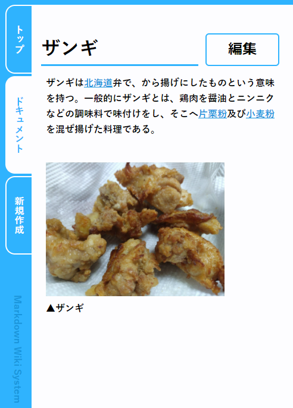
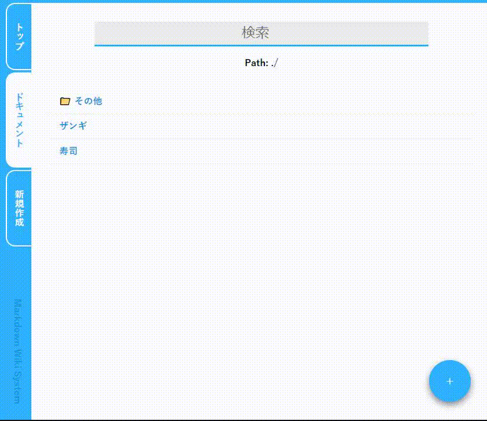

<p align="center">
 
 <h2 align="center"><a href="https://tomsuzuki.github.io/markdown-wiki/">markdown-wiki</a></h2>
 <p align="center">マークダウンで記事を作成できるタイプのWikiっぽいもの。</p>
</p>

## 起動方法
```shell
go run main.go
```
`go 1.15`を使用します。

## 操作方法
サーバーを起動し、ブラウザで [http://localhost:9988/](http://localhost:9988/) を開いてトップページの説明を読んでください。

## 見た目




## 使用しているマークダウン生成関数
[TomSuzuki/white600: Markdown → HTML](https://github.com/TomSuzuki/white600)
